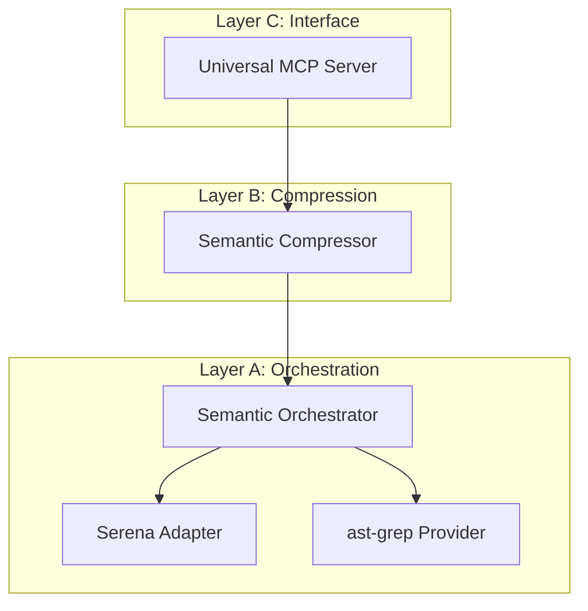

# 🕸️ Omni-Link: Universal Semantic Intelligence Bridge

[](https://opensource.org/licenses/MIT)
[](https://github.com/oraios/serena)
[](https://ast-grep.github.io/)
[](https://www.typescriptlang.org/)

**Omni-Link** is a high-performance MCP (Model Context Protocol) server designed to provide AI agents with a proactive "Spider-Sense" regarding codebase architecture. It acts as an orchestration layer that understands symbols, dependencies, and structural impact across multiple languages and projects without saturating the token window.

---

## 🚀 Key Value Proposition

Omni-Link solves the "Context Overload" problem by replacing raw code dumps with **High-Density Semantic Advisories**.

- **Multi-Engine Orchestration:** Automatically routes requests to specialized engines (Serena for TS/JS, ast-grep for Python/Go/Rust and directory analysis).
- **Cross-Project Semantic Intelligence (CPSI):** Detects breaking changes and logic reuse across your entire workspace.
- **Semantic Compression:** Distills complex AST data into concise, agent-optimized contexts (~500 tokens).
- **Hardware-Safe:** Optimized for local development with minimal I/O and SSD-safe caching strategies.

---

## 🏗️ Architecture

Omni-Link follows a strictly decoupled three-layer architecture:



---

## 🛠️ Available MCP Tools

| Tool | Purpose | Key Benefit |
| :--- | :--- | :--- |
| `get_spider_sense` | Compressed structural overview of a path. | Understand architecture in < 500 tokens. |
| `analyze_impact` | Local reference analysis. | Prevent breaking changes in the current repo. |
| `get_global_impact` | **Workspace-wide** dependency analysis. | Detect cross-project "butterfly effects". |
| `check_expert_rules` | **Sentinel**: Validate code against expert rules. | Ensure compliance with project-specific gotchas. |
| `get_health` | Multi-engine status and telemetry. | Ensure semantic engines are alive and responsive. |

---

## 💻 Quick Start

### Prerequisites
- **Node.js / Bun**
- **Serena MCP:** (Auto-spawned via `uvx`)
- **ast-grep:** `cargo install ast-grep` (for non-TS projects)

### Installation
```bash
bun install
npm run build
```

### Configuration (Antigravity/Claude/Gemini CLI)
Add the following to your `mcp_config.json`:
```json
"omni-link": {
  "command": "node",
  "args": ["/absolute/path/to/omni-link/build/index.js"]
}
```

---

## 🛡️ Engineering Principles (MASTER-PROTOCOL)

Omni-Link development is governed by the `MASTER-PROTOCOL.md`:
- **DRY:** Never reinvent the parser; leverage existing high-performance binaries.
- **KISS:** Keep the agent interface simple; hide the complexity of multi-engine routing.
- **LEAN:** No visual fluff, no "AI Lore". Pure, high-density data.

---

## 📄 License
Distributed under the MIT License. See `LICENSE` for more information.

---
### Manual Test
```bash
node scratch/test_mcp.js
```

---
---
## 👤 Author

**Leonardo Vergara**
- Email: [leonardovergaramarin@gmail.com](mailto:leonardovergaramarin@gmail.com)
- Web: [iodevs.net](https://iodevs.net)
- Company: [ionet.cl](https://ionet.cl)

---
**Omni-Link** — *Giving Agents the Vision to Build Resilient Systems.*
